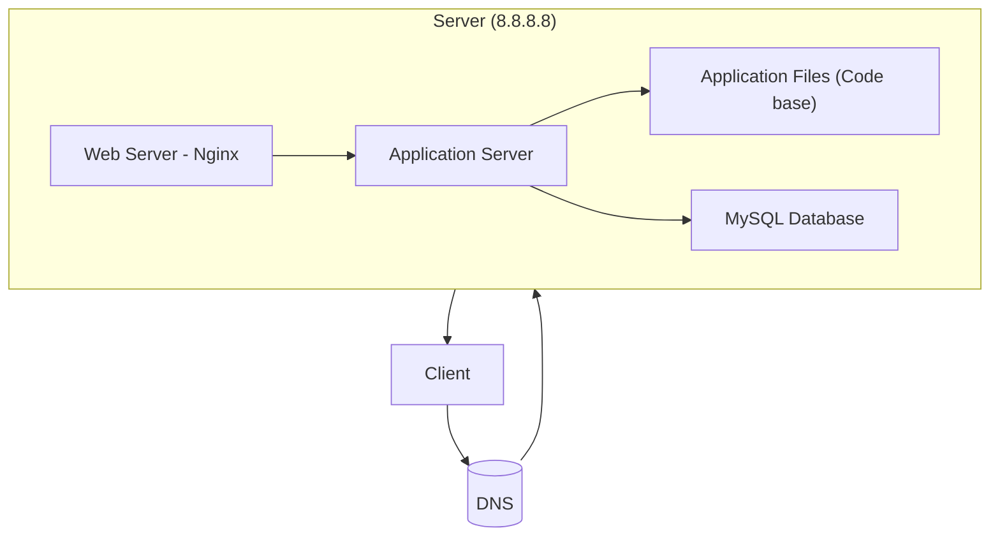

# 0. Simple web stack

## 📌 Description

This simple web infrastructure hosts the website `www.foobar.com` on a single server.
It includes:

- A domain name (`foobar.com`) with a **www** DNS record pointing to the IP `8.8.8.8`.
- One server running:
  - **Web server (Nginx)**
  - **Application server**
  - **Application files (code base)**
  - **Database (MySQL)**

---

## 🌍 How it works (User flow)

1. A user types `www.foobar.com` in their browser.
2. The **DNS** resolves the domain name into the server IP `8.8.8.8`.
3. The browser sends a request to the server.
4. The **web server (Nginx)** receives the HTTP request.
5. Nginx forwards the request to the **application server**.
6. The application server executes the code and queries the **MySQL database** if needed.
7. The response is returned to Nginx, which sends it back to the user’s browser.

---

## 🔧 Components explanation

- **Server** → A physical or virtual machine that provides services to clients over a network.
- **Domain name** → A human-readable address (like `foobar.com`) that maps to the server’s IP.
- **DNS record (www)** → A type of DNS record called an **A record**, which maps `www.foobar.com` to `8.8.8.8`.
- **Web server (Nginx)** → Handles HTTP requests, serves static files, and forwards dynamic requests to the application server.
- **Application server** → Runs the application logic (code base).
- **Database (MySQL)** → Stores and retrieves structured data used by the application.
- **Communication** → The server communicates with the user’s browser via the **HTTP protocol** over TCP/IP.

---

## ⚠️ Issues and limitations

- **SPOF (Single Point of Failure):** if the server goes down, the entire website is unavailable.
- **Downtime during maintenance:** restarting the server or deploying new code causes service interruption.
- **No scalability:** one server cannot handle a large increase in traffic.

---

## 📸 Diagram (Simple Web Stack)

