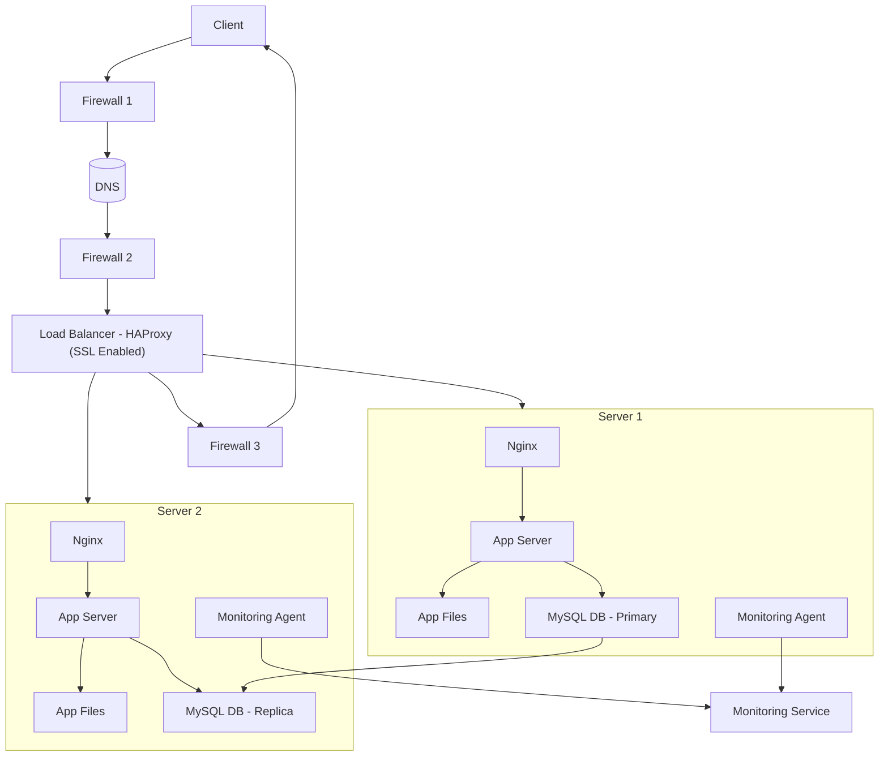

# 2. Infrastructure web sécurisée et monitorée

## 📌 Description

Cette infrastructure est basée sur l’infrastructure distribuée (tâche 1), mais elle ajoute des mécanismes de **sécurité**, de **chiffrement** et de **surveillance**.

Elle comprend :

- **3 pare-feux** (un pour le client → LB, un entre LB → serveurs, un pour les bases de données).
- **1 certificat SSL** (HTTPS activé pour `www.foobar.com`).
- **3 agents de monitoring** (installés sur chaque serveur).

---

## 🌍 Fonctionnement (flux utilisateur)

1. L’utilisateur tape `https://www.foobar.com`.
2. Le **DNS** résout le domaine vers l’adresse IP du load balancer.
3. La connexion est sécurisée via **SSL (HTTPS)**.
4. Le **load balancer** répartit le trafic vers les serveurs disponibles.
5. Chaque serveur traite la requête :
   - **Nginx** reçoit et déchiffre la requête si SSL est terminé côté serveur.
   - L’**application server** exécute la logique.
   - La **base MySQL** peut être interrogée (primaire/réplica).
6. Les **agents de monitoring** collectent des métriques (CPU, mémoire, QPS, erreurs) et les envoient à une plateforme de monitoring externe.
7. La réponse est renvoyée via le load balancer jusqu’au navigateur du client.

---

## 🔧 Explication des ajouts

- **Pare-feu** : filtre le trafic et protège contre les attaques externes.
- **SSL/HTTPS** : chiffre les communications entre le client et le serveur.
- **Monitoring** : permet de détecter pannes, pics de charge, et collecter des métriques (par ex. QPS).

---

## ⚠️ Problèmes et limites

- **SSL au niveau du Load Balancer** : si le déchiffrement est fait au LB, le trafic interne vers les serveurs peut être non chiffré.
- **Un seul serveur MySQL en écriture** : risque de goulot d’étranglement ou panne critique.
- **Tous les serveurs contiennent les mêmes composants** (app + web + DB) : difficile à scaler et maintenir.

---

## 📸 Diagramme (Infrastructure sécurisée et monitorée)

